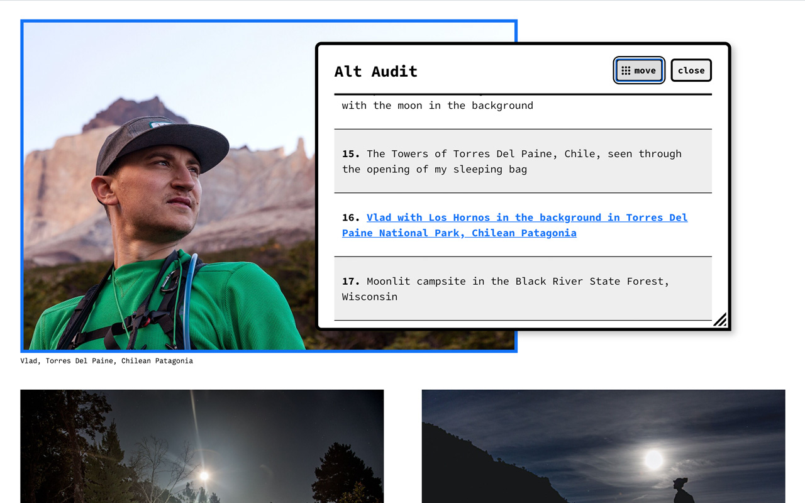

# Alt Audit
A browser extension to help you audit pages for alt text.

## Installation
Install it from the [chrome web store](https://chrome.google.com/webstore/detail/alt-audit/knpagjbjmcocipojngdfnalpojcjhbof) on your chromium browser of choice, or clone this repo and [install it as an "unpacked extension"](https://webkul.com/blog/how-to-install-the-unpacked-extension-in-chrome/). Updates to this repo will be more frequent than updates to the web store because it usually takes a few days for updates to be reviewed and approved there.

## Why?
There are lots of other resources that will do a better job of explaining the importance of Alternative Text ([this](https://webaim.org/techniques/alttext/), [this](https://axesslab.com/alt-texts/), or [this](https://www.w3.org/WAI/tutorials/images/decision-tree/)), but I built this tool to help myself gain some insight for the use of alt text specifically on photography websites, including my own. I wanted to start gathering information on the how, if at all, alt text is used on images on photography websites — where the images _are_ the content. I started on inspecting images manually at first, then wrote a script to do it for me from the console, and then decided to turn it into this browser extension. Its intension is not to tell you how to fix your alt text necessarily, but to give you a quick overview of the alt text present on a page so you can see very quickly where the gaps are and decide how to fill them yourself. Or if you're like me and just polling sites for your own insight, it gives you a quick way of doing that.

## To Do:
- [x] Flag alt text that appears to match an image's caption or title

## Contribute
If you have any ideas for features feel free to add them as an issue flagged with "enhancement" or submit a pull request.